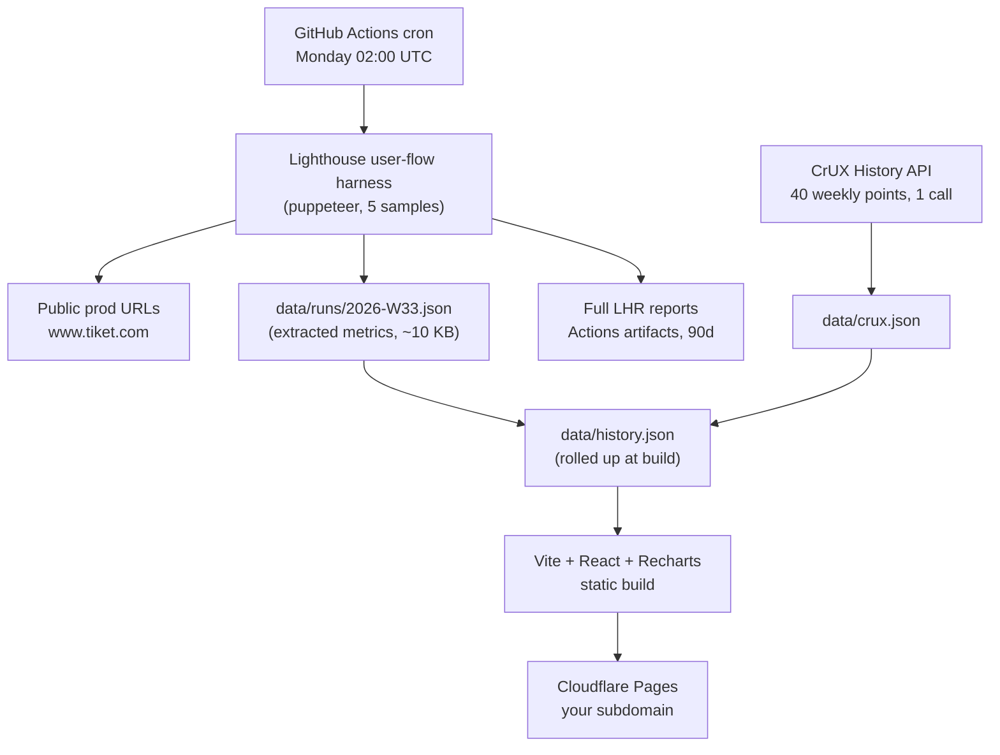

# Weekly Core Web Vitals Trend Dashboard

## Architecture




Total recurring cost: **$0**. No database, no server, no paid tier.

## Key decisions and why

- **Self-run Lighthouse, not PSI.** PSI's lab block is not delayed, but it is one uncontrolled sample from an unspecified datacenter with no INP. Self-running gives median-of-5, your existing viewports, and real INP via user flows.
- **Personal public repo.** The data is already public — anyone can query CrUX for `tiket.com` or run Lighthouse against it without credentials — so publishing it discloses nothing new. Public also makes Actions minutes and Pages entirely free. Do not copy the internal analysis docs into it.
- **Puppeteer, not Playwright.** See the comparison below. Lighthouse user flows only take a Puppeteer page.
- **Cloudflare Pages, not Vercel.** See the hosting section below.
- **Git as the datastore.** ~10 KB/week. See the storage-longevity section below.
- **Median of 5 samples, with min/max stored.** Your doc shows CLS reproducible to 4 decimal places but LCP inheriting the search API's variance, so the chart must show a variance band or it will lie.

## Puppeteer vs Playwright

Playwright is the better tool in the abstract, and two of its advantages matter here:

- `getByRole` / `getByTestId` with built-in retry are more robust than Puppeteer's waiting, which matters for a filter-sheet click that must not flake unattended for years.
- The trace viewer (`trace.zip`, video, screenshots on failure) beats anything Puppeteer offers for diagnosing a 2am failure.

Puppeteer still wins this one, on a narrow but decisive point:

- **Lighthouse user flows require a Puppeteer page.** `startFlow(page)` takes a Puppeteer `Page`, and Lighthouse's docs state multi-step flows are "currently only available using the Lighthouse Node API along with Puppeteer." Reaching timespan mode from Playwright needs a small third-party CDP bridge — a fragile dependency in the exact load-bearing spot.
- Timespan-mode INP is the whole reason we self-run Lighthouse rather than call PSI. Losing it collapses the design back to something PSI does for free.
- `lighthouse` already depends on `puppeteer-core`, so there is no version drift to manage.
- Your documented SRP methodology is already Puppeteer (`evaluateOnNewDocument`), so it transfers directly.

Mitigating the two Playwright advantages:

- Puppeteer v20+ has `page.locator()` with auto-waiting, plus `aria/` and `::-p-text()` selectors, which closes most of the selector gap.
- Save the Lighthouse flow HTML report as an Actions artifact on every run — that recovers most of the debugging story for free.

**The coherent Playwright alternative,** if you would rather go that way: drop Lighthouse entirely and rebuild your SRP harness's raw `PerformanceObserver` approach in Playwright (`page.addInitScript()` is the exact equivalent of `evaluateOnNewDocument`, with CDP for throttling). You already trust that methodology. The cost is losing the Lighthouse score, the diagnostic audits that tell you *what* regressed rather than just *that* it did, and Lantern simulated throttling — which is the thing keeping a weekly trend line from being noise.

## Storage: git is fine essentially forever

- One weekly run file: 2 targets x 2 form factors x ~8 metrics x `{median, min, max}` plus context, roughly **10 KB**.
- 52 weeks x 10 KB = **~520 KB/year**.
- GitHub's soft repo limit is 1 GB. At this rate that is **~1,900 years**. At ten times the targets, ~190 years.

Storage size is not a constraint by three orders of magnitude. Two things that *would* actually bite, both already handled:

- **Full Lighthouse JSON reports are 0.5-2 MB each.** 20 per week reaches 1 GB inside a year. So git holds only extracted metrics; full LHR and HTML reports go to Actions artifacts (free, 90-day retention).
- **Git history bloat from rewriting one aggregate file weekly.** Avoided because `history.json` is generated at build time, never committed.

**Why not Supabase.** Free projects pause after **7 days without database activity**, and this job writes exactly once every 7 days — you would sit on the boundary and need a *second* cron whose only purpose is keeping the database awake. Add an API key to rotate, a network dependency that can fail the scan job, a 2-project cap, and a dashboard that now needs runtime fetching. For a single-writer, append-only, 10 KB/week workload with no query requirements, it buys nothing. If a database ever genuinely becomes necessary, Turso or Cloudflare D1 fit small time-series better than Supabase.

## Hosting: Cloudflare Pages, not Vercel

**Deploying to Vercel would not improve server location.** Hosting location determines how fast the dashboard loads for whoever opens it. The measurement happens on the GitHub Actions runner in Azure US/Europe, entirely independent of where the dashboard is deployed. Vercel also cannot be the scan runner: Hobby cron fires at most once daily and functions have hard duration caps, so 15 minutes of headless Chrome is impossible there.

**Vercel Hobby also carries a licensing risk.** Their fair-use policy restricts Hobby to non-commercial personal use, and defines commercial as any deployment for "the financial gain of anyone involved in any part of the production of the project, including a paid employee... writing the code." A dashboard monitoring your employer's production site, built by that employer's engineer, is at best a gray area. For a static site that uses none of Vercel's platform features, that is risk for nothing.

**Cloudflare Pages** gives free hosting, custom subdomain with automatic TLS, unlimited bandwidth, and explicitly permits commercial use. GitHub Pages is a fine fallback and also supports a custom domain.

**If you want in-region measurement,** the only real lever is a self-hosted GitHub Actions runner in Southeast Asia. Oracle Cloud's Always Free tier includes ARM instances in Singapore, free permanently, which comfortably run headless Chrome. Treat this as an optional later phase — trends are valid without it.

## What gets built

### 1. The harness (`scan/run.mjs`)

Node 20 + `lighthouse` v12 + `puppeteer`. Per target, per form factor, 5 iterations:

```js
const flow = await startFlow(page, { config: { settings: { formFactor, screenEmulation, throttling } } });
await flow.navigate(url);                    // LCP, CLS, FCP, TTFB, TBT, SI, score
await flow.startTimespan({ name: 'open-filter-sheet' });
await page.locator(FILTER_TRIGGER).click();
await page.locator(FILTER_SHEET).wait();
await flow.endTimespan();                    // interaction-to-next-paint
```

Navigation steps use Lighthouse's default simulated throttling (lowest run-to-run variance); the timespan uses devtools throttling at 4x CPU to match the mobile config in [docs/srp-cwv-analysis-engineering.md](docs/srp-cwv-analysis-engineering.md).

**Targets** (confirmed, hotel only — no NHA in the first cut):

- Landing: `https://www.tiket.com/en-id/hotel`
- SRP: `https://www.tiket.com/en-id/hotel/search?room=1&adult=1&id=jakarta-108001534490276204&type=REGION&q=Jakarta` (same URL as your analysis; carries no date params so it won't go stale. Note the app appends a `searchSessionId` client-side after load, which is a `replaceState`, not a real navigation)
- PDP: `https://www.tiket.com/en-id/hotel/indonesia/the-apurva-kempinski-bali-202001550596500105`

Form factors: mobile 390x844 DPR3 4x CPU, desktop 1440x900 unthrottled. 3 targets x 2 form factors x 5 samples puts runtime around 18-27 min/week, well inside the 6h job limit.

### Interaction hooks — verified against production

Inspected live on 12 Aug 2026. Timespan steps are mobile-only; desktop filters are an inline sidebar rather than a sheet, and your analysis found desktop interactions fast unthrottled anyway.

- **Landing — open destination autocomplete:** `[data-testid="destination-input"]`. Stable.
- **SRP — open sort sheet:** `[data-testid="chip-sort-filter"]`. Stable. Measured 152 ms in your analysis, so it passes; useful as a control series.
- **PDP — see room / render room list:** `[data-testid="button-see-room"]`, settle on `[data-testid="room-list-container"]`. Stable, and it is the primary conversion action.
- **SRP — open filter sheet:** no `data-testid` and no `aria-label`, so it needs a scoped CSS-module selector:

```js
const chips = [...document.querySelectorAll(
  '[class*="SrpFilterChipsMobile_wrapper__"] > button[class*="Chip_chip__"]'
)].filter((b) => b.textContent.trim() === 'Filter');
if (chips.length !== 1) throw new Error(`filter chip: expected 1 match, got ${chips.length}`);
```

Verified live on 12 Aug 2026. Why each piece is needed:

- The `File_localClass__` prefix **survives the production build** (`SrpFilterChipsMobile_wrapper__XXv0z`), so prefix matching is immune to hash churn. Only a rename of the component file or the `wrapper` local class breaks it.
- The wrapper scope is required because a separate `FlashSaleTabContent_chips__` container on the same page also uses `Chip_chip__`.
- The scope alone does **not** disambiguate: all 7 chips are direct children of that one wrapper, so "Popular Filter" is a sibling. Exact text equality is what separates them — a substring match would hit both.
- **Do not use position.** Two of the seven chips are marketing campaign chips ("Up to 50% off", "Concert Deals") that come and go, so index 0 is not stable week to week.
- The uniqueness assertion turns a silent 0 ms reading into a loud failure.

Residual risk: the prefix format depends on the CSS Modules ident template. The build is `next build --webpack` today; a future Turbopack migration could change the naming scheme. The assertion catches it.

This is the 256 ms interaction — the only one failing the 200 ms threshold in your analysis — so it is the most valuable series in the dashboard. Adding `data-testid="chip-filter"` to that chip in `TIX-HOTEL-NEXT-FE` remains worth doing eventually, but the selector above is solid enough that it is no longer a blocker.

**Card-count context** uses `[data-testid="full-product-card"]` / `[data-testid="accom-product-card"]`, both confirmed present.

**Context capture via CDP**, so a spike is explainable rather than mysterious: whether `page-modules-full` returned a promo, the first search-API request duration, and the count of rendered cards. Your own data shows promo presence alone once moved mobile CLS from 0.02 to 0.39 — without this, content changes look like code regressions.

Selectors are resolved from existing `data-testid` / `aria-label` attributes, verified once at setup, and the run **fails loudly** if not found rather than silently reporting a 0 ms interaction.

### 2. Storage schema (`data/runs/YYYY-Www.json`)

Per target x form factor: `{ median, min, max }` for `lcp / cls / fcp / ttfb / tbt / speedIndex / perfScore`, plus `inp` keyed by interaction name, plus the context block and `lighthouseVersion` (so a Lighthouse upgrade that shifts scoring is visible in the data).

`data/crux.json` holds one CrUX History response per form factor for origin `https://www.tiket.com`, overwritten each week.

### 3. The workflow (`.github/workflows/weekly-cwv.yml`)

Cron Monday 02:00 UTC, plus `workflow_dispatch` for on-demand runs. One job: scan, fetch CrUX, commit the run file, upload full LHR reports as artifacts, roll up `history.json`, build, deploy.

Deploy must live in this same job — commits pushed with `GITHUB_TOKEN` do not trigger downstream workflows, so a separate on-push deploy would never fire.

Runtime ~12-18 min/week, free on a public repo.

### 4. The dashboard (Vite + React + TypeScript + Recharts)

- One line chart per metric, x-axis weeks, one series per target x form factor, toggleable
- Google threshold bands as `ReferenceArea` (good / needs-improvement / poor)
- Shaded min-max variance band per series — non-negotiable given LCP noise
- Latest-week summary grid: value, week-over-week delta, pass/fail
- Run-context strip beneath each chart (promo present, search API ms) so spikes are attributable
- Separate **Field data** tab for CrUX, labeled "real users, 28-day rolling window, reflects a fix ~4 weeks after release"

Reads `history.json` as a static import at build time. No runtime fetch, no CORS, no backend.

## Accuracy caveats to accept up front

- **Runner location.** GitHub-hosted runners sit in Azure US/Europe; tiket.com serves SEA. Since ~72% of your LCP is the search API wait, absolute LCP will read meaningfully higher than your local numbers. Week-over-week trends stay valid because the location is constant. The Oracle Cloud Singapore runner above is the fix if absolutes matter.
- **Lab INP is an approximation.** Scripted clicks on one interaction path, not the p75 of all real interactions. The CrUX panel is what settles it.
- **SRP content varies weekly** (inventory, promo, pricing). The context block makes this explainable but not eliminable.
- Scheduled workflows are disabled after 60 days of repo inactivity; the weekly data commit counts as activity, so this is self-sustaining.

## Settled

- **Repo:** [devinekadeni/tiket-accom-cwv-dashboard](https://github.com/devinekadeni/tiket-accom-cwv-dashboard) — verified public and empty, so Actions minutes and Pages are both free.
- **Subdomain:** `tiket-accom-cwv.devinekadeni.com`, Cloudflare wiring deferred to a later phase.
- **Targets:** the three hotel URLs above. No NHA in the first cut.

- **Filter selector:** scoped CSS-module prefix plus exact text, per the harness section. The `data-testid` PR is deferred as a nice-to-have.
- **Workspace:** clone to `~/Documents/tiket_code/tiket-accom-cwv-dashboard`, copy this plan in, then continue in a Cursor window opened on that folder.
- **CrUX:** included; key to be created.

## Your one task: the CrUX API key

Fast path — on [the CrUX API docs page](https://developer.chrome.com/docs/crux/api) there is an **Enable the Chrome UX Report API** button that creates a project, enables the API, and hands you a key in one step.

Manual path:

1. Open [the API library page](https://console.cloud.google.com/apis/library/chromeuxreport.googleapis.com), pick or create any project, click **Enable**. No billing account required.
2. Go to **APIs & Services -> Credentials -> Create credentials -> API key**.
3. Click **Edit API key** and set **API restrictions** to only the Chrome UX Report API. Leave application restrictions as None, since it is called from a CI runner with no fixed IP.
4. Add it to the repo as a secret named `CRUX_API_KEY`, either at
   `https://github.com/devinekadeni/tiket-accom-cwv-dashboard/settings/secrets/actions`
   or with `gh secret set CRUX_API_KEY --repo devinekadeni/tiket-accom-cwv-dashboard`.

Quota is 150 queries/minute, free. This job uses 2 per week.

